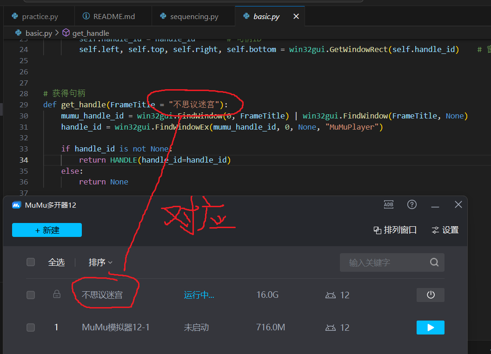

# 不思议迷宫神锻半自动脚本
### 说明
该脚本为不思议迷宫神锻刷金过程中的半自动工具，旨在解决刷金过程中繁琐的sl操作。

### mumu模拟器显示设置

### 显示器设置

### 句柄设置

### 其他：

1.时停的数字可能会遮挡熔炉，导致寻找熔炉失败。

|  实现功能   | 代码位置  |
|  ----  | ----  |
| 测序  | sequencing.py |
| 黑水池  | sl_pool.py |
| 黑尸体  | sl_body.py |
| 黑装备 | sl_equip.py |
| 黑卷轴  | sl_scroll.py |
| 自动永动机  | pool_sequencing.py |